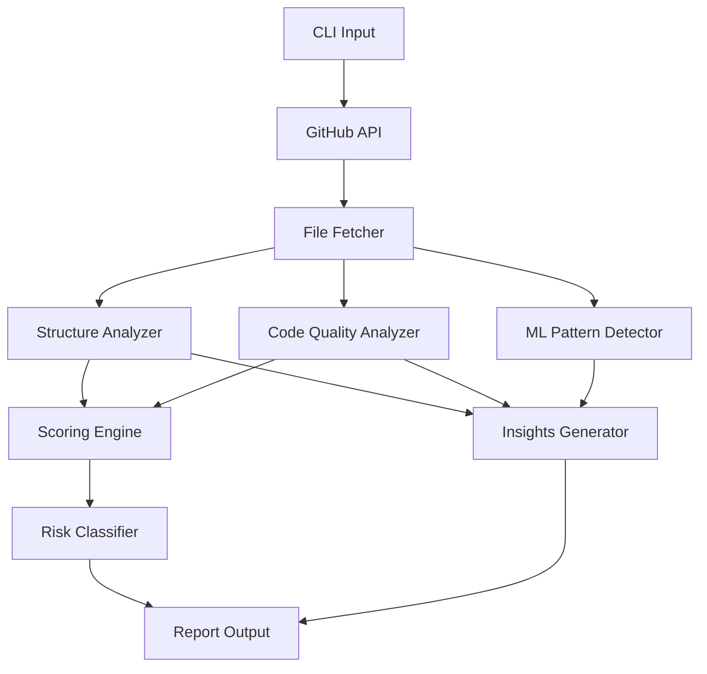

<div align="center">

# ML Reproducibility Auditor
### A CLI tool to analyze machine learning repositories for reproducibility, engineering quality, and ML systems design signals.

</div>

---

## Motivation

Most machine learning repositories:

- Cannot be reliably reproduced
- Lack dependency and environment clarity
- Provide no benchmark guarantees
- Hide system-level bottlenecks

This tool evaluates repositories through a **systems lens**, focusing on:

- Reproducibility signals
- Engineering maturity
- ML systems design patterns

---

## Installation

```bash
pip install -e .
```

---

## Usage

```bash
ml-audit https://github.com/user/repo
```

JSON output:

```bash
ml-audit https://github.com/user/repo --json
```

---

## Example Output

```
Repository: user/repo

Structure Analysis:
- has_readme: YES
- has_license: YES
- has_ci: NO
- has_benchmarks: YES

Reproducibility Score: 7.5/10
Risk Level: MEDIUM

Code Quality Signals:
- has_pinned_dependencies: YES
- has_seed_control: NO
- has_training_loop: YES

ML Systems Detection:
- uses_pytorch: YES
- uses_distributed: YES
- uses_all_reduce: YES

Insights:
- No CI/CD detected → changes are not automatically validated
- Missing seed control → results may not be reproducible
```

---

## Features

- GitHub API integration (with authentication support)
- Repository structure analysis (CI/CD, benchmarks, datasets)
- Code quality analysis (dependencies, determinism, training loops)
- Reproducibility scoring with weighted signals
- Risk classification (LOW / MEDIUM / HIGH)
- ML systems pattern detection (PyTorch, distributed training, all-reduce)
- Code-level inspection via GitHub API
- Insight generation based on system signals
- JSON output for automation and pipelines
- Rich CLI interface (tables, colors)

---

## Architecture



---

## Design Principles

- **Reproducibility-first** — treat environment and determinism as first-class concerns
- **Signal over noise** — focus on high-impact engineering indicators
- **System-aware analysis** — go beyond files into behavior and patterns
- **Composable design** — CLI + JSON for integration into workflows

---

## Evaluation Dimensions

The scoring system considers:

- Environment setup (dependencies, packaging)
- Determinism (seed control)
- Documentation
- Testing and validation
- CI/CD pipelines
- Benchmarking practices
- Dataset reproducibility
- Configuration-driven experimentation

---

## Roadmap

- [ ] AST-based static analysis (deeper code understanding)
- [ ] Dataset pipeline validation
- [ ] Training loop structure detection
- [ ] Performance bottleneck hints
- [ ] Multi-repo comparison
- [ ] Web dashboard (FastAPI)

---

## Why This Matters

Reproducibility is a major gap in real-world ML systems.

This project explores how:

- System design decisions affect reproducibility
- Engineering practices impact reliability
- Scalability constraints influence outcomes

---

<div align="center">

*Omprakash Sahani — ML Systems Engineer (Distributed Training · Optimization · Systems)*

</div>